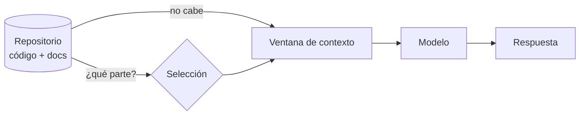
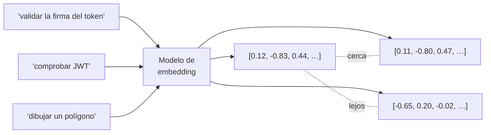
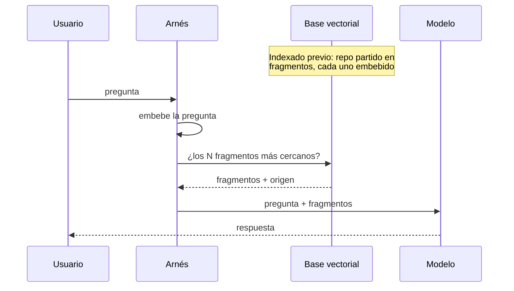
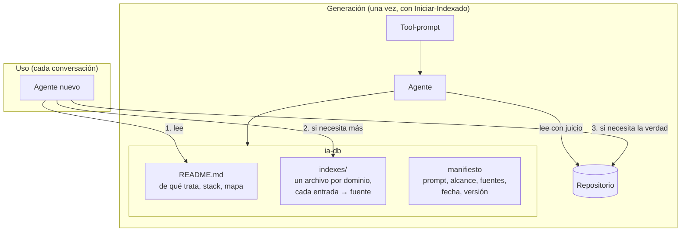
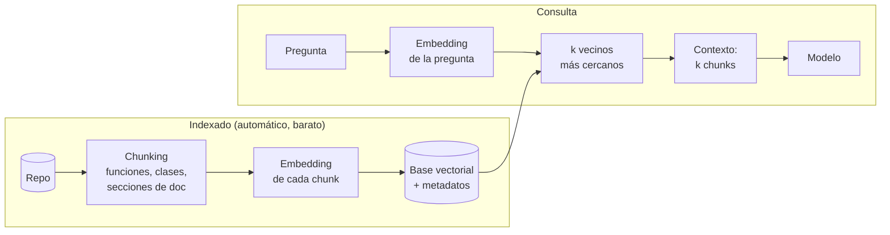
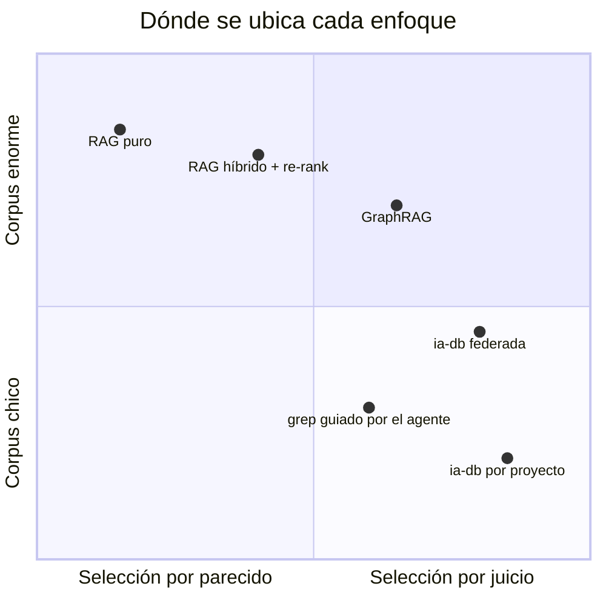
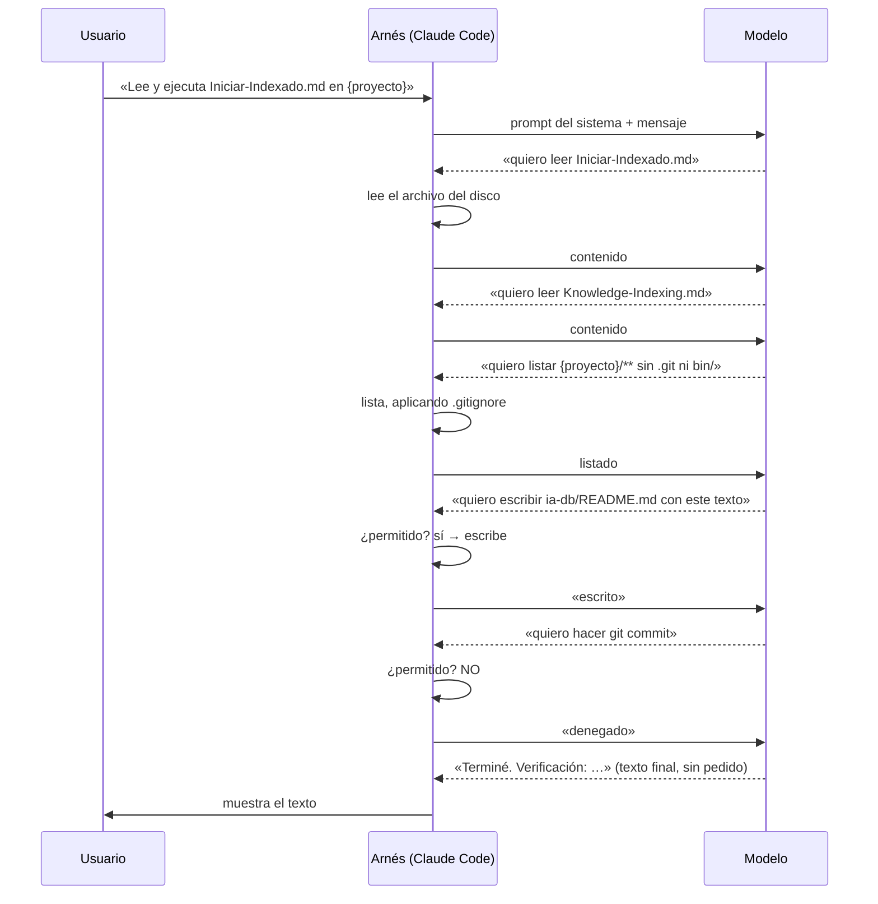
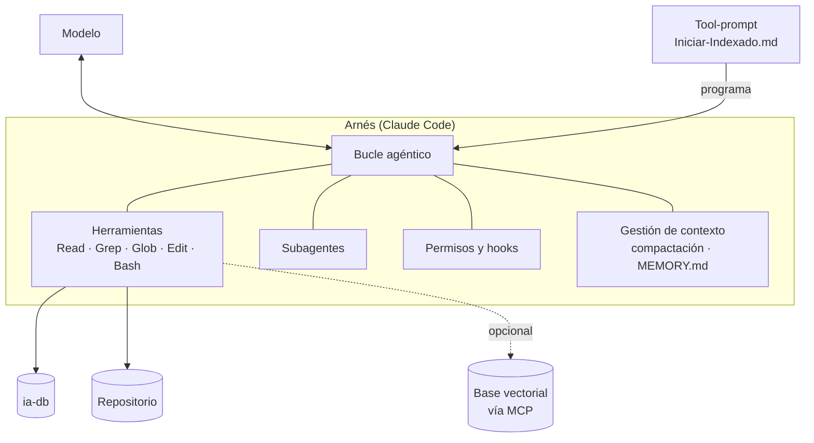
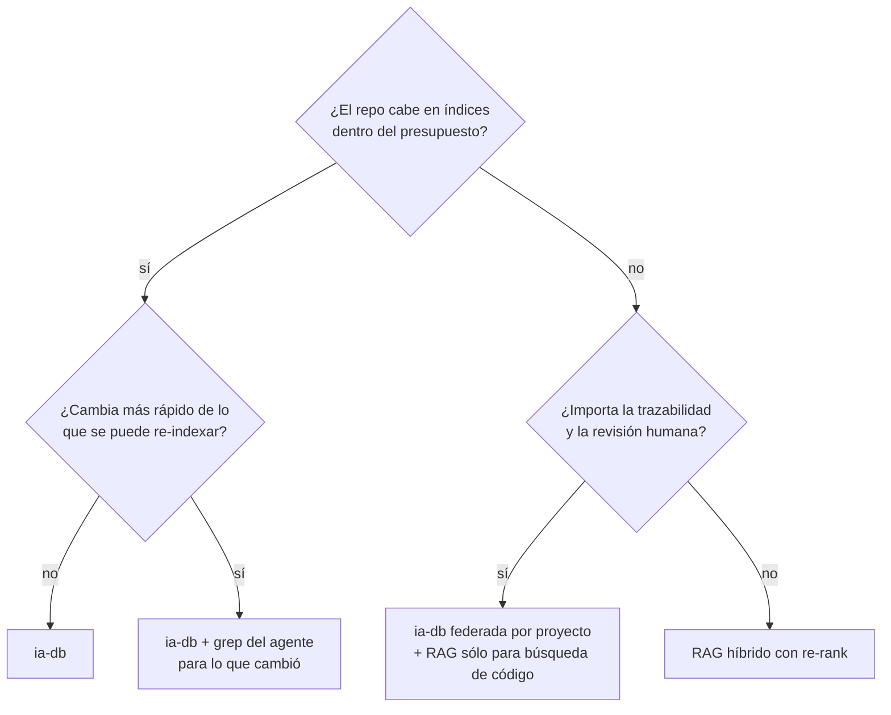
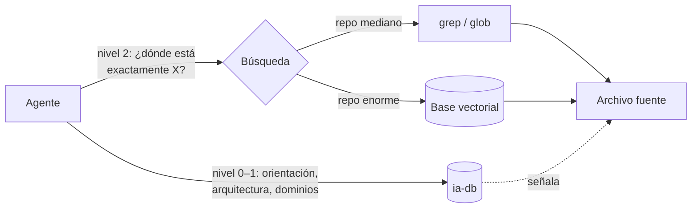

# Metodología: base vectorial vs. ia-db

> **Análisis** — qué tenemos hoy (la ia-db generada por `Iniciar-Indexado.md`), qué existe afuera (embeddings, RAG, arneses) y qué aporta cada cosa como finalidad.
> Fecha: 2026-09-13 · Versión 1.0

---

## Índice

1. [El problema que ambos resuelven](#1-el-problema-que-ambos-resuelven)
2. [Definiciones](#2-definiciones)
   - 2.1 Modelo
   - 2.2 Ventana de contexto
   - 2.3 Token
   - 2.4 Embedding
   - 2.5 Base vectorial
   - 2.6 RAG
   - 2.7 Arnés (harness)
   - 2.8 Índice simbólico / ia-db
3. [Qué tenemos: la ia-db](#3-qué-tenemos-la-ia-db)
4. [Qué hay afuera: embeddings y RAG](#4-qué-hay-afuera-embeddings-y-rag)
5. [Comparación](#5-comparación)
6. [El arnés: dónde vive todo esto](#6-el-arnés-dónde-vive-todo-esto)
7. [La finalidad de la ia-db](#7-la-finalidad-de-la-ia-db)
8. [Cuándo conviene cada enfoque](#8-cuándo-conviene-cada-enfoque)
9. [Modelo mixto](#9-modelo-mixto)
10. [Ideas abiertas](#10-ideas-abiertas)
11. [Glosario rápido](#11-glosario-rápido)

---

## 1. El problema que ambos resuelven

Un modelo de lenguaje sólo razona sobre lo que tiene en su **ventana de contexto**. Un repositorio no cabe ahí, y aunque cupiera, meterlo entero en cada conversación es caro, lento y degrada la calidad (el modelo se distrae con lo irrelevante).

El problema, entonces, es siempre el mismo: **¿cómo elegir qué poner en el contexto para que el modelo responda bien sin releerlo todo?**

Hay dos familias de respuesta a esa pregunta:

- **Índice simbólico** (lo que tenemos): un modelo lee el repo *una vez*, con juicio, y produce un resumen estructurado y navegable. Las conversaciones futuras leen el resumen y profundizan sólo donde hace falta.
- **Índice vectorial** (lo que hay afuera): el repo se parte en fragmentos, cada uno se convierte en un vector, y en cada pregunta se recuperan los fragmentos matemáticamente más cercanos.

---

## 2. Definiciones

### 2.1 Modelo

El modelo de lenguaje (LLM). Recibe texto, produce texto. **No tiene memoria** entre llamadas: todo lo que sabe de tu proyecto en una conversación es lo que alguien le puso en el contexto en esa conversación.

### 2.2 Ventana de contexto

La cantidad máxima de texto (medida en tokens) que el modelo puede ver en una sola llamada. Incluye instrucciones, archivos leídos, la conversación y la respuesta. Es finita, cuesta dinero por token y cuanto más llena está, más ruido compite con la señal.

### 2.3 Token

La unidad en que el modelo cuenta el texto: aproximadamente ¾ de palabra en inglés, algo menos en castellano. Un archivo de 1.000 líneas de C# son del orden de 10–15k tokens. Los límites de sesión ("agotamiento") se cuentan en tokens consumidos.

### 2.4 Embedding

Un **vector** (una lista de cientos o miles de números) que representa el *significado* de un fragmento de texto. Lo produce un modelo de embedding, distinto del LLM y mucho más barato. Su propiedad central: dos textos que hablan de lo mismo quedan **cerca** en ese espacio, aunque no compartan palabras.

El embedding **no entiende** el texto: lo ubica. Sirve para buscar por parecido, no para razonar.

### 2.5 Base vectorial

Una base de datos que guarda vectores y responde a la consulta «dame los N vectores más cercanos a este». Ejemplos: pgvector, Qdrant, Chroma, Pinecone. Se acompaña de metadatos (archivo de origen, líneas) para poder volver del vector al texto.

### 2.6 RAG

**Retrieval-Augmented Generation** — generación aumentada por recuperación. Es el patrón completo que usa embeddings:

La selección de contexto la hace **una métrica de distancia en el momento de consultar**.

### 2.7 Arnés (harness)

Todo lo que rodea al modelo para que haga trabajo real: el bucle que lo llama, las herramientas que le expone (leer, buscar, editar, ejecutar), los permisos, la gestión de contexto (compactación, memoria persistente), los hooks, los subagentes.

Claude Code **es** un arnés; el modelo es lo que corre adentro. Un tool-prompt como `Iniciar-Indexado.md` no es sólo texto para el modelo: es un **programa para el arnés**, porque depende de sus capacidades (subagentes en paralelo, filtros por `.gitignore`, permisos que impiden `commit`).

### 2.8 Índice simbólico / ia-db

Un índice **legible** del repositorio, escrito por un modelo con criterio: qué es el proyecto, con qué stack, qué dominios de conocimiento tiene, dónde está cada cosa y de qué fuente sale cada afirmación. En nuestro caso, la `ia-db`: `README.md` como punto de entrada, `indexes/` por dominio y un manifiesto de generación.

La selección de contexto la hace **el modelo, con juicio, en el momento de indexar**; en la consulta el agente navega el índice.

---

## 3. Qué tenemos: la ia-db

Generada por `/IA/IA.Prompts/Tool-Prompts/Indexado-Documentado/Iniciar-Indexado.md` conforme al Profile `Knowledge-Indexing.md`.

Rasgos que la definen:

- **Curada por razonamiento**: el modelo decide qué es un dominio, qué es el punto de entrada, qué depende de qué. Capta *estructura*, no sólo contenido.
- **Legible y versionable**: es Markdown; se revisa en un PR, se difiere con `git`, la lee un humano.
- **Trazable**: cada entrada apunta a una fuente. «No inventar información» es una restricción del prompt, no una esperanza.
- **Reproducible**: el manifiesto permite regenerar (`Iniciar-Indexado`) o actualizar (`Actualizar-Indexado`) sin información externa.
- **Federable**: varios proyectos → un `ia-db` raíz que referencia las ia-db propias en vez de duplicarlas.
- **Acotada**: el Profile fija un presupuesto de tamaño por índice. Eso es la garantía de que leer el índice sea barato.

### Contrato de lectura en capas

La idea de fondo — *contexto especificado + índice para profundizar sin sobrecargar la entrada* — es un contrato de tres niveles de costo:

| Nivel | Qué lee el agente | Costo | Cuándo |
|---|---|---|---|
| 0 | `README.md` | Fijo, pequeño | Siempre, al arrancar |
| 1 | `indexes/<dominio>.md` | Fijo por dominio | Cuando la pregunta cae en ese dominio |
| 2 | El archivo fuente que el índice señala | Variable | Cuando necesita el detalle real o va a modificar |

Nunca se paga el nivel 2 sin haber pasado por el 0 y el 1, y el 0 y el 1 tienen tope. Eso es lo que hace que «funcione bastante bien»: el costo por conversación deja de ser proporcional al tamaño del repo.

---

## 4. Qué hay afuera: embeddings y RAG

Pipeline típico de un RAG sobre código:

Rasgos que lo definen:

- **Indexado sin razonamiento**: el modelo de embedding no juzga; ubica. Es barato y escala a millones de fragmentos.
- **Selección por parecido**: recupera lo que *suena* a la pregunta. Falla cuando la pregunta usa otro vocabulario que el código, o cuando la respuesta exige juntar piezas dispersas que individualmente no se parecen a la pregunta.
- **Opaco**: nadie lee un vector. No hay PR de revisión del índice, no hay trazabilidad más allá del metadato «vino de este archivo».
- **Sin estructura**: el vector de `AuthManager.cs` no sabe que es el punto de entrada de la autenticación; sólo sabe a qué se parece.
- **Actualización incremental trivial**: cambia un archivo, se re-embebe ese archivo.

Variantes que mejoran sus puntos débiles: búsqueda híbrida (vectores + léxica tipo BM25), *re-ranking* con un LLM sobre los candidatos, *GraphRAG* (se construye un grafo de entidades con un LLM y se recupera por grafo, que es, en el fondo, acercarse a un índice simbólico).

---

## 5. Comparación

| Dimensión | ia-db (índice simbólico) | Embeddings / RAG |
|---|---|---|
| Quién decide qué es relevante | El modelo, con juicio, **al indexar** | Una distancia, **al consultar** |
| Qué captura | Estructura, dependencias, puntos de entrada, dominios | Parecido semántico entre fragmentos |
| Forma del índice | Markdown legible, versionable | Vectores opacos |
| Trazabilidad | Cada entrada → fuente, verificable | Metadato de origen; no hay «afirmaciones» |
| Costo de generar | Alto: una pasada completa con razonamiento | Bajo: modelo de embedding, sin razonamiento |
| Costo por consulta | Fijo y acotado (nivel 0 + 1) | Sólo los k chunks; muy bajo |
| Actualizar | `Actualizar-Indexado` + manifiesto | Re-embeber lo cambiado |
| Falla cuando | El índice envejece o el dominio no fue previsto | Vocabulario distinto; respuesta que exige juntar piezas |
| Escala | Hasta que un índice supera su presupuesto | Millones de fragmentos |
| Infraestructura | Ninguna: archivos en el repo | Modelo de embedding + base vectorial + pipeline |
| Revisable por humanos | Sí, en un PR | No |
| Alineado con SDD | Sí: trazabilidad, no inventar, manifiesto | Parcialmente |

---

## 6. El arnés: dónde vive todo esto

### 6.1 El modelo solo no puede hacer nada

El modelo es una función **texto → texto**. Recibe un texto, devuelve un texto. No puede abrir un archivo, ejecutar un comando, crear una carpeta ni recordar la conversación anterior. Si se le escribe «leé `Iniciar-Indexado.md`», por sí solo no puede: no tiene manos.

Quien lee el archivo es el **arnés**.

### 6.2 El arnés es el bucle que le presta manos

Lo que ocurre, literalmente, al correr `Iniciar-Indexado.md`:

El modelo **nunca toca nada**: escribe pedidos y el arnés los ejecuta —o los niega— y le devuelve el resultado. El ida y vuelta se repite hasta que el modelo responde sin pedir nada. Ese bucle, con sus herramientas y sus reglas, **es** el arnés.

Imagen: el modelo es un consultor que no sale de la sala y sólo se comunica por notas escritas. El arnés es quien está del otro lado de la puerta: le lleva las notas, va a buscar los archivos que pide, ejecuta lo que manda y decide qué pedidos se cumplen.

### 6.3 Mapa entre el tool-prompt y las piezas del arnés

| Lo que dice el prompt | Pieza del arnés que lo hace posible |
|---|---|
| «Lee y ejecuta …» | **Herramientas** (`Read`): el modelo pide, el arnés lee |
| «indexar en paralelo con subagentes (uno por proyecto)» | **Subagentes**: el arnés abre otro bucle igual, con contexto propio, y devuelve al principal sólo el informe final |
| «no escanear `.git`, dependencias, lo ignorado por `.gitignore`» | **Filtros de búsqueda** (`Glob`/`Grep`): el arnés excluye antes de mostrar |
| «no hacer commit, push ni PR» | **Permisos**: el arnés niega el pedido aunque el modelo lo formule |
| «respetar el presupuesto de tamaño por índice» | **Ninguna**: lo cumple el modelo por obediencia; por eso hay que verificarlo |
| `MEMORY.md`, memorias entre sesiones | **Memoria persistente**: el arnés las inyecta al inicio de cada conversación |
| Corte por agotamiento de tokens | **Gestión de sesión**: el arnés detiene el bucle; `autoContinueAtUsageLimit` es el arnés esperando y reanudando |
| Compactación de conversaciones largas | **Gestión de contexto**: el arnés resume el historial y sigue |
| «cada vez que se edite un archivo, correr X» | **Hooks**: código del arnés alrededor de cada pedido, sin pasar por el modelo |

La ia-db en este esquema es **un archivo que el arnés le lee al modelo cuando el modelo lo pide**. No es parte del arnés ni del modelo: es conocimiento en disco, y su valor es que el primer pedido de cada conversación («leé `ia-db/README.md`») trae mucho por pocos tokens.

### 6.4 Dos tipos de instrucción en un prompt

- **Las que el arnés garantiza** (permisos, filtros, subagentes, memoria): se cumplen aunque el modelo se distraiga.
- **Las que sólo el modelo cumple** («no inventar», «presupuesto por índice», «cada entrada trazable»): dependen de obediencia. La sección «Verificación de finalización» de los tool-prompts existe para controlar exactamente esto.

Cuando una regla falla repetidamente en un prompt, la pregunta útil es: ¿debería vivir en el arnés (un hook, un permiso) en lugar de en el texto?

### 6.5 Vista de conjunto

Tres observaciones:

1. **Claude Code no usa embeddings.** Busca con `grep`/`glob` guiado por el modelo: el agente razona hacia la fuente en vez de que un vector se la acerque. Es la misma filosofía de la ia-db, y por eso encajan bien: la ia-db le ahorra al agente los primeros pasos de esa búsqueda.
2. **El tool-prompt es un programa para el arnés.** «Indexar en paralelo con subagentes», «no escanear lo ignorado por `.gitignore`», «no hacer commit» son instrucciones que sólo tienen sentido porque el arnés tiene subagentes, filtros y permisos.
3. **Los límites de sesión son del arnés, no del modelo.** El agotamiento de tokens que corta un indexado largo se resuelve en el arnés (`autoContinueAtUsageLimit`), y la ia-db lo mitiga de raíz: cada conversación siguiente consume menos.

---

## 7. La finalidad de la ia-db

Vista contra los otros conceptos, la ia-db no es «un RAG casero». Es otra cosa, con otra finalidad:

> **Darle al agente un contexto de entrada especificado y acotado, y un mapa para profundizar por decisión propia, sin que nadie —ni un vector— le meta en el contexto lo que no pidió.**

Lo que aporta, en concreto:

- **Contexto de entrada especificado.** El `README.md` de la ia-db es *el* contrato de arranque: qué es esto, con qué stack, qué dominios existen. Un agente nuevo no adivina; lee.
- **Profundización bajo control del agente.** El índice dice dónde está cada cosa. El agente decide si baja al nivel 2. En RAG, la decisión la toma la distancia antes de que el modelo pueda opinar.
- **Costo predecible.** Presupuesto por índice → el nivel 0 y 1 tienen un tope conocido. La sobrecarga de contexto se evita por diseño, no por suerte.
- **Conocimiento que sobrevive a la conversación.** El modelo no tiene memoria; la ia-db es la memoria del proyecto, en el repo, bajo control de versiones.
- **Auditable y trazable.** Cada afirmación del índice sale de una fuente. Se puede leer, discutir en un PR y corregir. Coincide con la disciplina del SDD (no inventar, dejar evidencia, manifiesto).
- **Sin infraestructura.** Archivos Markdown. No hay servicio que mantener, ni modelo de embedding que versionar, ni base que migrar.

Lo que **no** aporta, y hay que saberlo:

- No escala a corpus que no quepan en un resumen curado.
- Envejece: si nadie corre `Actualizar-Indexado`, miente por omisión.
- Depende de que el modelo que indexó haya previsto el dominio de la pregunta futura.

---

## 8. Cuándo conviene cada enfoque

Reglas prácticas:

- **Repos de un producto, con SDD, revisados por personas** → ia-db. Es nuestro caso.
- **Corpus documental enorme y heterogéneo** (miles de tickets, wikis, correos) → RAG. Nadie puede curarlo.
- **«¿Dónde está el código que hace X?» en un monorepo gigante** → RAG o híbrido léxico; el índice simbólico no llega al detalle de cada función.
- **Preguntas de arquitectura** («¿por qué esto depende de aquello?») → ia-db. El vector no sabe de dependencias.

---

## 9. Modelo mixto

No son excluyentes. Un diseño razonable para cuando un proyecto crezca:

La ia-db sigue siendo el contrato de entrada; la base vectorial, si algún día hace falta, sería una herramienta más del nivel 2, expuesta al arnés vía MCP, nunca el punto de arranque.

---

## 10. Ideas abiertas

- **Presupuesto medido, no estimado.** Registrar en el manifiesto los tokens reales del `README.md` y de cada índice, y que `Actualizar-Indexado` avise cuando uno se acerca al tope del Profile.
- **Frescura declarada.** Que el manifiesto guarde el commit indexado y que el agente, al arrancar, compare con `HEAD`: si divergen mucho, que lo diga antes de confiar en el índice.
- **Índice de preguntas.** Además de índices por dominio, un índice «¿cómo hago X?» → ruta de archivos. Es lo más parecido a lo que un RAG recupera bien, sin perder trazabilidad.
- **Evaluar el índice como se evalúa un RAG.** Un conjunto fijo de preguntas por proyecto y medir si el agente llega a la fuente correcta leyendo sólo la ia-db. Sería la evidencia de que «funciona bastante bien» en vez de la sensación.
- **Federación por referencia.** Ya está en el prompt (no duplicar ia-db de proyectos que la tienen); queda ver cómo envejece un índice federado cuando los hijos se actualizan por separado.

---

## 11. Glosario rápido

| Término | En una línea |
|---|---|
| **Token** | Unidad de conteo de texto del modelo (~¾ de palabra) |
| **Ventana de contexto** | Máximo de tokens que el modelo ve en una llamada |
| **Embedding** | Vector que ubica un texto por su significado; sirve para buscar por parecido |
| **Base vectorial** | Base que responde «los N vectores más cercanos a este» |
| **Chunk** | Fragmento en que se parte un documento para embeberlo |
| **RAG** | Patrón: recuperar fragmentos por parecido y dárselos al modelo |
| **Búsqueda híbrida** | Vectores + búsqueda léxica (BM25) combinados |
| **Re-rank** | Un LLM reordena los candidatos recuperados antes de usarlos |
| **GraphRAG** | RAG sobre un grafo de entidades construido por un LLM |
| **Arnés** | Todo lo que rodea al modelo: bucle, herramientas, permisos, memoria |
| **Tool-prompt** | Prompt que programa al arnés para una tarea (ej. `Iniciar-Indexado.md`) |
| **Índice simbólico** | Resumen estructurado y legible de un corpus, escrito con juicio |
| **ia-db** | Nuestro índice simbólico: `README.md` + `indexes/` + manifiesto |
| **Manifiesto de generación** | Registro de cómo se generó la ia-db para poder regenerarla |
| **Modo federado** | Una ia-db raíz que referencia las ia-db de varios proyectos |
| **MCP** | Protocolo por el que el arnés expone herramientas externas (p.ej. una base vectorial) |
